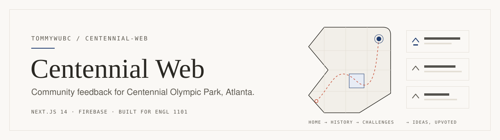
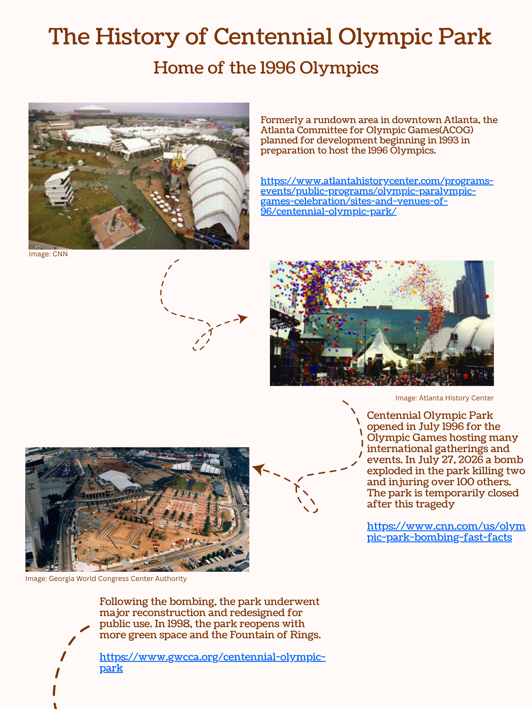
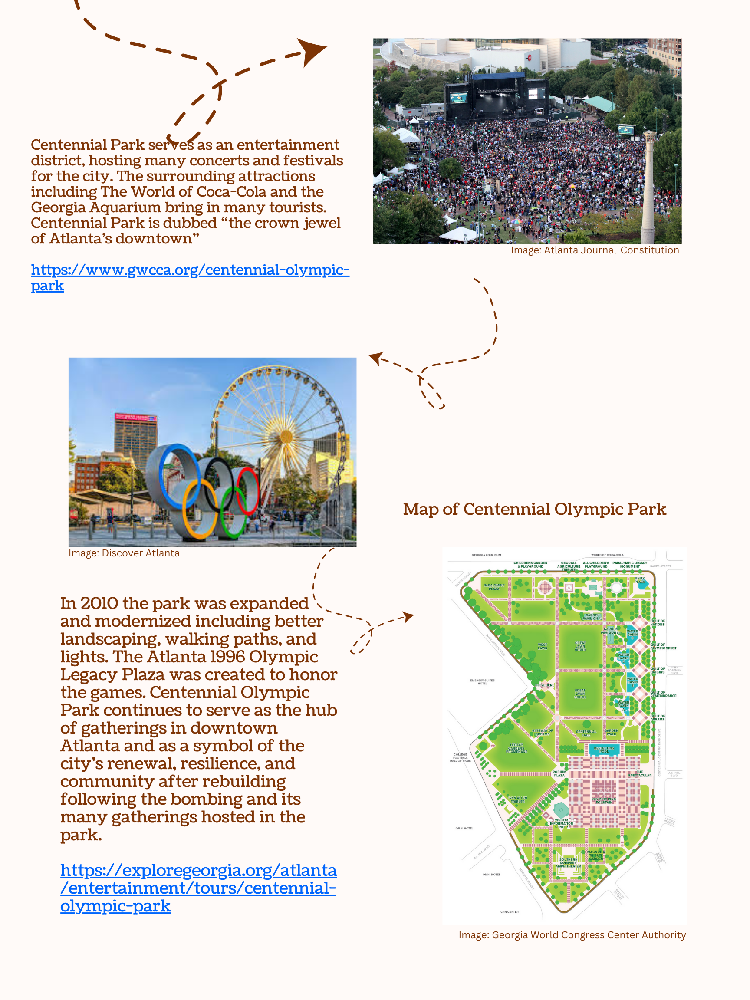
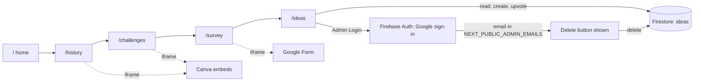

<picture>
  <source media="(prefers-color-scheme: dark)" srcset=".github/assets/banner-dark.svg">
  
</picture>

A small Next.js + Firebase site that asks visitors of Centennial Olympic Park in Atlanta what the park is getting wrong and what they'd change. Built for English 1101 in November 2025.

## Why

The assignment was about civic engagement, not software. The site was the delivery mechanism: a QR code in the park leads here (the home page opens with "Thank you for scanning the QR code!"), visitors get a short tour of the park's history and its current problems, then they're asked for two things:

1. an anonymous survey response (an embedded Google Form), and
2. a public, upvotable idea for what the Georgia World Congress Center Authority (GWCCA), which runs the park, should change.

The goal is to turn "someone should fix this" into a ranked list of things people actually asked for.

## The pages

The site is a linear walk. Each page ends with a button to the next one, and the navbar lets you jump around.

| Route | Nav label | What's on it |
| --- | --- | --- |
| `/` | Home | Who we are, why we're asking, a photo of the park, "About the park →" |
| `/history` | About the Park | Two embedded Canva pages: the 1996 Olympics, the bombing, the 1998 reopening, the 2010 expansion |
| `/challenges` | Ongoing Challenges | Two embedded Canva pages on current issues: gun rules, nighttime safety, public funding, the loss of large events |
| `/survey` | Survey | The Google Form, embedded from `NEXT_PUBLIC_GOOGLE_FORM_ID` |
| `/ideas` | Ideas | A Reddit-style board: post an idea (80-char title, 300-char body), sort by Newest or Top, upvote once per browser |

Every page shares a navbar, a footer ("Student project for ENGL1101. Not affiliated with the City of Atlanta."), and a floating text-to-speech button that reads the page's `<main>` aloud using the browser's `speechSynthesis` API. The Canva embeds also carry screen-reader-only text with the same content, since an iframe of a poster is otherwise invisible to assistive tech.

<p>
  
  
</p>
<sub>The two history posters shown on <code>/history</code>, with their image and source credits.</sub>

## How it fits together

The only moving parts are on `/ideas`. Everything else is static content plus third-party embeds.



A few details worth knowing:

- **Ideas** live in one Firestore collection, `ideas`, each with `title`, `content`, `votes`, `voters`, `createdAt` (see `lib/utils.ts`). "Top" sorts by `votes` then `createdAt`, which needs a composite index. Firebase prints a link to create it the first time.
- **Voting** is anonymous. Each browser gets a random voter ID in `localStorage`, and the idea stores the list of IDs that have voted. That stops accidental double votes, not determined ones: clear your storage and you can vote again.
- **Admins** sign in with a Google popup (`lib/auth.ts`). The admin check compares the signed-in email to the comma-separated `NEXT_PUBLIC_ADMIN_EMAILS`. That check only decides whether the UI shows a Delete button. Real protection has to come from Firestore security rules, and [SETUP.md](SETUP.md) has a starting set.

## Run it locally

You need Node, npm, and a Firebase project with Firestore and Authentication turned on.

```bash
npm install
# create .env.local with your Firebase config, admin emails and Google Form ID
npm run dev          # http://localhost:3000
```

[SETUP.md](SETUP.md) has the full list of `.env.local` keys, the Firestore index, example security rules, and deployment notes for Vercel (`vercel.json` is included) and Firebase Hosting.

Without `NEXT_PUBLIC_GOOGLE_FORM_ID`, the survey page shows a "configure your Google Form ID" message instead of the form. Everything else still renders.

## Repository layout

```
app/
  page.tsx              home
  history/page.tsx      park history (Canva embeds + sr-only text)
  challenges/page.tsx   current issues (Canva embeds + sr-only text)
  survey/page.tsx       embedded Google Form
  ideas/page.tsx        idea board: post, sort, upvote, admin delete
  layout.tsx            navbar, footer, text-to-speech button, Merriweather font
components/             Navbar, Footer, AdminLogin, DeleteModal, TextToSpeechButton
lib/
  firebase.ts           app, Firestore and Auth from NEXT_PUBLIC_* env vars
  auth.ts               Google sign-in, logout, admin-email check
  utils.ts              Firestore reads/writes for ideas, local vote tracking
public/images/          park photos, history posters, brick background
SETUP.md                Firebase setup, env vars, rules, deployment
```

## Notes

- Student project for ENGL 1101. Not affiliated with the City of Atlanta or the GWCCA.
- The photos inside the history posters and the home-page image belong to the sources credited on them (CNN, Atlanta History Center, GWCCA, AJC, Discover Atlanta, atlantaparent.com).
- `SETUP.md` still says to enable Email/Password auth. The admin login in the code uses Google sign-in, so enable the Google provider too.
